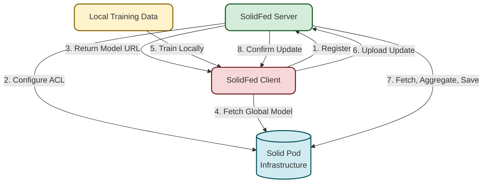

# SolidFed: Decentralized Federated Learning on Solid Pods

SolidFed is an asynchronous federated learning system built on Solid Pods, enabling collaborative machine learning while preserving data sovereignty and privacy.

## Table of Contents

- [Project Overview](#project-overview)
- [Architecture](#architecture)
- [Components](#components)
- [Unique Aspects](#unique-aspects)
- [Current Limitations](#current-limitations)
- [Getting Started](#getting-started)
- [Documentation](#documentation)

## Project Overview

SolidFed implements an asynchronous federated learning approach where:

- Users train machine learning models on their local data
- Only model weights (not data) are shared through Solid Pods
- A server orchestrates registration and aggregation
- Differential privacy protects against data extraction
- Clients can join and contribute asynchronously

This approach ensures that no raw data ever leaves the user's device while still enabling collaborative improvement of shared models.

## Architecture



The architecture consists of:

1. **SolidFed Server**: Central coordinator managing model registration and aggregation
2. **Solid Pod Infrastructure**: Decentralized storage for model files with ACL permissions
3. **SolidFed Client**: User-facing application for training and contributing to models
4. **Local Training Data**: User data that remains on client devices

The numbered flow shows the full federated learning process:
1. Client registers with server for a model
2. Server configures access control on Solid Pods
3. Server provides model location to client
4. Client downloads current global model
5. Client trains locally on private data
6. Client uploads model update (not raw data)
7. Server performs aggregation and saves updated model
8. Server confirms successful update to client

## Components

SolidFed consists of two main components:

### Server

The server component provides:
- API endpoints for registration and model updates
- Asynchronous model aggregation with configurable learning rate
- Solid Pod integration for decentralized storage
- Permission management for client access
- Aggregation history tracking

### Client

The client component offers:
- Interactive CLI for federated learning participation
- Local training with Python-based scripts
- Differential privacy options for data protection
- Direct Solid Pod authentication and access
- Multi-model support for participation in various projects

## Unique Aspects

SolidFed implements several novel approaches that distinguish it from other federated learning systems:

### 1. Solid Protocol Integration

SolidFed leverages the Solid protocol to create a truly decentralized federated learning system. This provides:
- Data sovereignty by design - users fully control their data
- Standard-based access control mechanisms
- Separation of storage from application logic
- Built on Web standards for interoperability

### 2. Asynchronous FedAsync Approach

Unlike traditional synchronous federated learning systems:
- Clients can join and contribute at any time
- Each update immediately impacts the global model
- Weighted averaging based on a learning rate parameter
- No waiting for round completion or specific client counts

### 3. Integrated Differential Privacy

Privacy is built into the system:
- Configurable epsilon and delta parameters
- L2 norm clipping to bound contribution influence
- Gaussian noise injection calibrated to sensitivity
- Privacy budget tracking across training rounds

### 4. Stateless Server Design

The server maintains minimal state:
- No permanent in-memory model representation
- Retrieves current model from Solid Pod for each update
- Saves updated model back to Pod after aggregation
- Allows for horizontal scaling and fault tolerance

## Current Limitations

While SolidFed provides a robust foundation for decentralized federated learning, there are several limitations in the current implementation:

### 1. Solid Server Variability

Even though the Solid protocol is robust, implementations of Solid servers (e.g., Inrupt or solidcommunity.net) can vary in stability and features. This can be mitigated by setting up a custom Community Solid Server (CSS) installation.

### 2. Race Conditions

Race conditions may occur if multiple users submit updates simultaneously, potentially leading to inconsistent aggregation. The current implementation lacks proper synchronization or locking mechanisms that would be necessary in a production FedAsync approach.

### 3. Manual ACL Setup

Server administrators must manually set up access control permissions for each new model folder. This requirement limits scalability and introduces potential security vulnerabilities if not properly executed.

### 4. Limited Model Types

The current implementation primarily supports simple models with direct weight representation. More complex model architectures or federated transfer learning approaches would require significant extensions.

### 5. Basic Aggregation Algorithm

The implemented FedAvg algorithm is a simplified version that may not perform optimally for all model types or datasets. More sophisticated aggregation techniques could improve convergence and performance.

## Getting Started

For detailed installation and usage instructions, refer to the individual README files in the server and client directories:

- [Server Documentation](./server/README.md)
- [Client Documentation](./client/README.md)

Quick start:

```bash
# Clone repository
git clone https://github.com/manapureanshul7/solidfed.git

# Server setup
cd solidfed/server
npm install
# Create .env file with required environment variables
npm start

# Client setup
cd ../client
npm install
# Create .env file with required environment variables
npm start
```

## Documentation

### Server API

| Endpoint | Method | Description |
|----------|--------|-------------|
| `/health` | GET | Check server status |
| `/config` | GET | View server configuration |
| `/register` | POST | Register client for model access |
| `/upload` | POST | Upload model weights |

### Client Commands

The client provides an interactive CLI with the following main options:
- Login to Solid Pod
- Register for models
- Download training data
- Download model & trainer code
- Train locally & upload weights

For detailed instructions, see the client documentation.

## License

This project is licensed under the MIT License - see the LICENSE file for details.